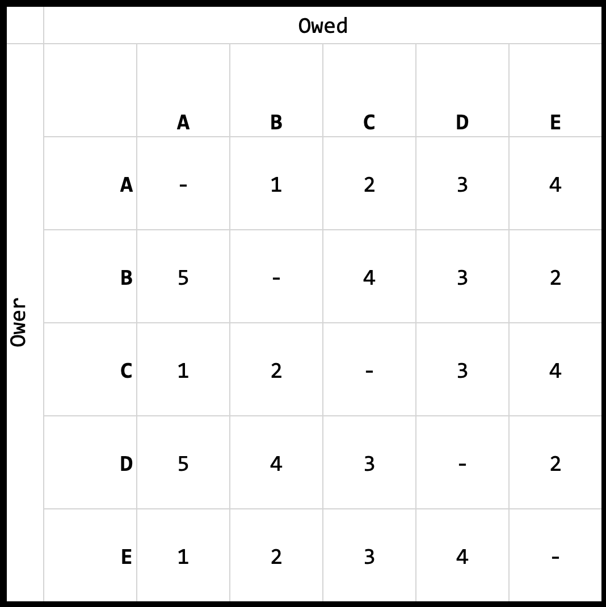
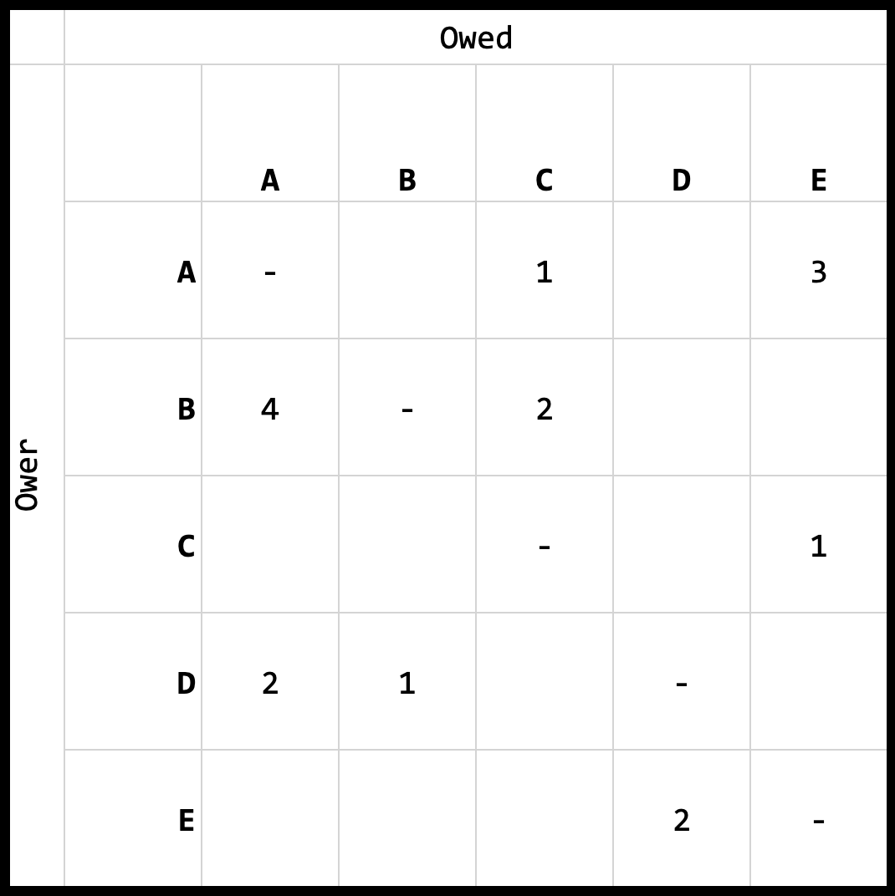
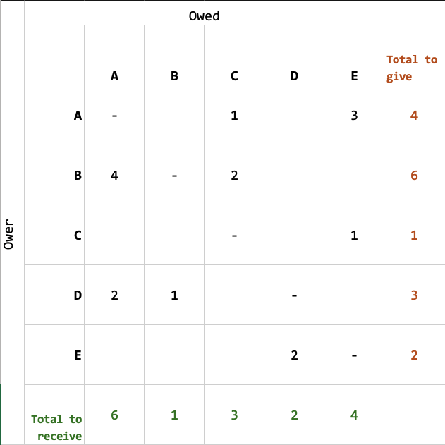
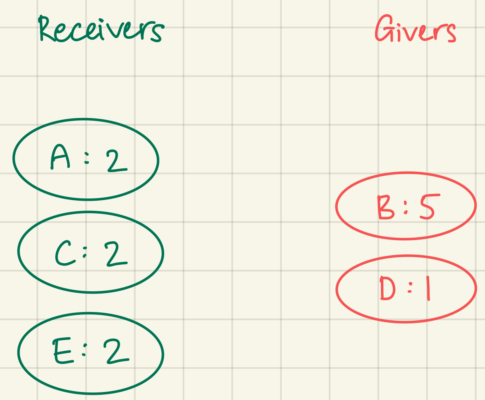
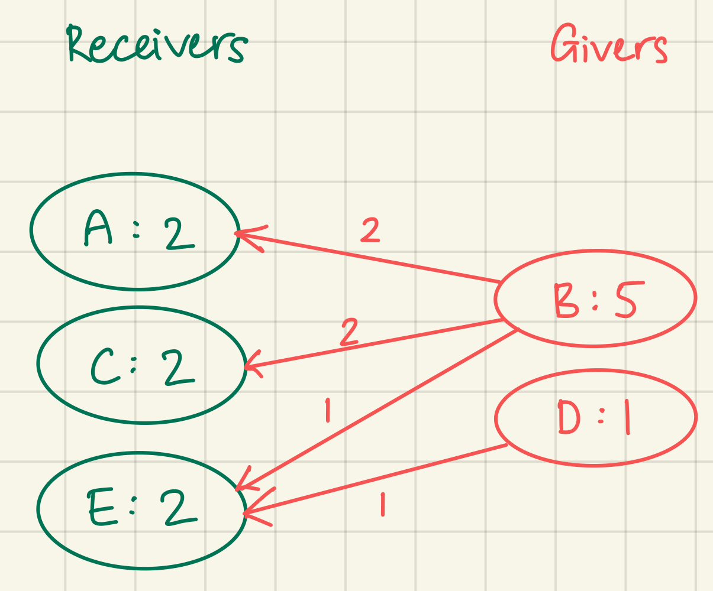

# SPLIIT

SPLIIT is a multi-user expense tracker for individuals and groups, particularly those traveling together, who need an efficient and organised way to manage shared financial obligations. 
SPLIIT serves as an all-in-one solution for group expense management, offering features like:
- trip management
- currency conversion
- expense tracking
- optimised debt settlement solution
- detailed transaction logs with geographical information

SPLIIT allows you to enjoy your trip, so leave the convoluted expense tracking to us!

View SPLIIT live at https://sc2006-spliit.vercel.app

<!-- ## Features -->

## The debt settlement algorithm in SPLIIT
Suppose there are _n_ people in a group, where some money is owed between them. The debt settlement algorithm solves for the minimum transactions required to settle all debts between owers and the owed. 

- In my implementation of this algorithm, the tabulated total amount owed from one person to another is represented as the `debt_matrix`. 
- Considering only the debt between two people, the amount owed between them can be reduced to just 1 or 0 transactions. This basic reduction is solved to become the `debt_matrix_reduced`. 
- Finally, the optimised transaction between all participants in the group that solves for all debts is represented as the `debt_matrix_simplified`.

The following in-depth explanation of the algorithm is represented with this example scenario:

"A group of 5 goes for a trip together. It is often convenient for one person to pay on behalf of others first, then settle the amount with the rest later. It is assumed that all recipients involved in the transaction pays an equal and proportionate amount of the transaction. At the end of the trip, the total transactions are summarised for reduction and simplification"

This algorithm takes 2 approaches to reduce and simplify the transactions.

### Debt Reduction
Reducing transactions will reduce unnecessary back-and-forth transactions.

For example, if A owes B $10, but B owes A $5, then A effectively only owes B $5. This reduces 2 transactions down to 1.

Now assume this debt matrix. Take RowA ColB for example. This cell refers to the amount that A owes B. Or A -> B. This cell represents A->B: 1.



Now see RowB ColA, or B -> A. Since RowB ColA represents the 'converse' of RowA ColB, we can deduce that A->B: 1, but B->A: 5. Since A owes B $1, but B owes A $5, B effectively only owes A $4. If we were to update Cell RowB ColA to 4, we should 'settle' this by updating Cell RowA ColB to 0. 

Intuitively, we can simply do: (RowX ColY) - (RowY ColX) for every transaction, and set negative values to 0. Reducing this debt matrix will result in this: The `reduced debt matrix`



Pay up! With this reduced matrix, we can effectively say that:

- A owes C $1
- A owes E $3
- B owes A $4
- B owes C $2
- C owes E $1
- D owes A $2
- D owes B $1
- E owes D $2

> Through debt reduction, the worst-case number of transactions required to settle all debt become $\frac{n(n-1)}{2}$, or effectively the number of edges in a fully connected graph, where _n_ is the number of people in this problem.

... but is this optimal?

### Debt Simplification
Imagine a cyclic debt scenario where 
- A owes B $5
- B owes C $5
- C owes A $5

It would be pretty silly to actually transact that amount between the 3 friends, because they effectively owe each other nothing!

So what can we do about this to simplify the transactions further such that a minimum number of transactions need to be made? On the surface, this appears as a graph cycle elimination problem. However, I realised that the amount each participant has to give and receive can be summarised by summing up the rows and columns. 



*Note that while this summary is done on the reduced debt matrix, using the basic debt matrix would still work.

The amount each participant would expect to receive in the end can then be tabulated by subtracting the amount they are expected to receive with the amount that they have to give.


We can then categorise these people into two groups: receivers and givers. Receivers are not expected to pay anybody (as they have paid for most of the group's share of expenses), while givers are expected to give since others have been helping them pay. 

|Receivers|Givers|
|:---:|:---:|
|A: 2|B: 5|
|C: 2|D: 5|
|E: 2|

Notice that the sum to receive is 0, which will always be the case. This is because the amount owed will always be to another person within the group.

Now, Receivers and Givers can be represented as a bipartite graph.



The problem now becomes one where givers must satisfy receivers with the least number of transactions. Here is one solution to the current problem:



Consider a different problem with the following Receivers, Givers and their corresponding amount:

|Receivers|Givers|
|:---:|:---:|
|D: 5|A: 2|
|E: 2|B: 4|
|    |C: 1|

One solution could involve 4 transactions (left), but the most optimal solution would be only 3 transactions to satisfy the debt problem (right).


To achieve the optimal solution, an algorithm to solve this bipartite part of the problem was designed that follows this logic:
- Satisfy the largest receiver with the largest giver first
    - Update the values for the receiver and the giver after this transaction
- Loop until there is nothing to receive and nothing to give

The algorithm was implemented in javascript in SPLIIT as:
```javascript
while (max(givers) && max(receivers)) {
    // (assuming giver = ower; receiver = owed)
    // - the biggest giver will give the biggest receiver first
    // - scenario 1: giver has not given away all their money yet
    // - scenario 2: receiver has not received all their money yet
    // - in either case, update their amount correspondingly
    // - loop again until everyone has been satisfied

    let max_giver = max(givers)
    let max_receiver = max(receivers)

    let amt_giver = givers[max_giver]
    let amt_receiver = receivers[max_receiver]

    let amt_given = Math.min(amt_giver, amt_receiver)
    let amt_left = amt_giver - amt_receiver
    if (amt_left > 0) { // giver still has money left after giving
        givers[max_giver] = amt_left // amount left to be given
        receivers[max_receiver] = 0 // receiver satisfied
    } else { // receiver still needs money after receiving OR receiver and giver both satisfied
        givers[max_giver] = 0 // giver satisfied
        receivers[max_receiver] = -1 * amt_left // amount left to be received
    }
    debt_matrix_simplified[max_giver][max_receiver] += amt_given
```

This algorithm ensures that transactions are fragmented as infrequently as possible. Finally, the simplified debt matrix can be determined by interpreting the bipartite graph. In the original example, the final simplified debt matrix looks like this:


> Through simplifying debt, the worst-case number of transactions required to satisfy all debt become _n_-1, where _n_ is the number of people involved in the debt problem.


## Set up instructions
### Frontend
Install frontend dependencies
```bash
cd SPLIIT/client
```

```bash
yarn install
```
Start frontend (You can open a browser and visit http://localhost:3000)
```bash
yarn start
```

### Backend
Install backend dependencies
```bash
cd SPLIIT/server
```

```bash
npm i
```
Start backend (You can test with http://localhost:5050)
```bash
npm run start
```

#### APIs used:
1. Exchange rates - https://exchangeratesapi.io/documentation/
1. Database - https://www.mongodb.com/
1. LLM - https://toolhouse.ai/
1. Authentication - https://developers.google.com/identity/protocols/oauth2

## Tech stack used
Frontend: React JS

Backend: Express JS

## Contributors

| Name          | GitHub       | Role             |
|--------------|---------------|----------------|
| Siah Yee Long      | @siahyeelong       | Full-stack; algorithm design and implementation |
| Goh Jun Keat     | @JKniaaa      | Front end |
| Koh Ze Kai Leo   | @Hotarun1    | LLM integration |
| Madhumita Thiruppathi | @madhu-dhudhu  | Documentation |
| Teo Liang Wei, Ryan  | @Paralyseds   | Documentation |
| Zhang Yichi  | @yichi0812   | LLM agent |